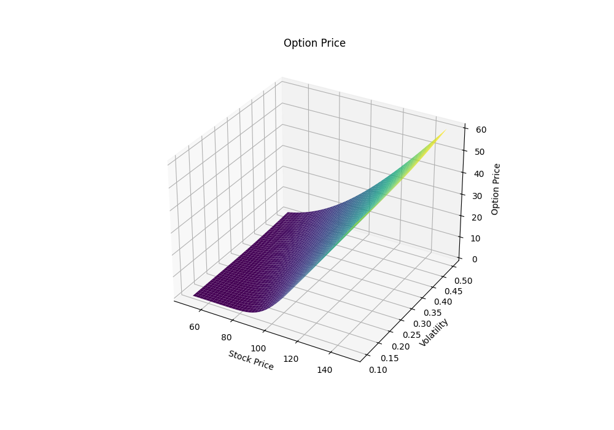
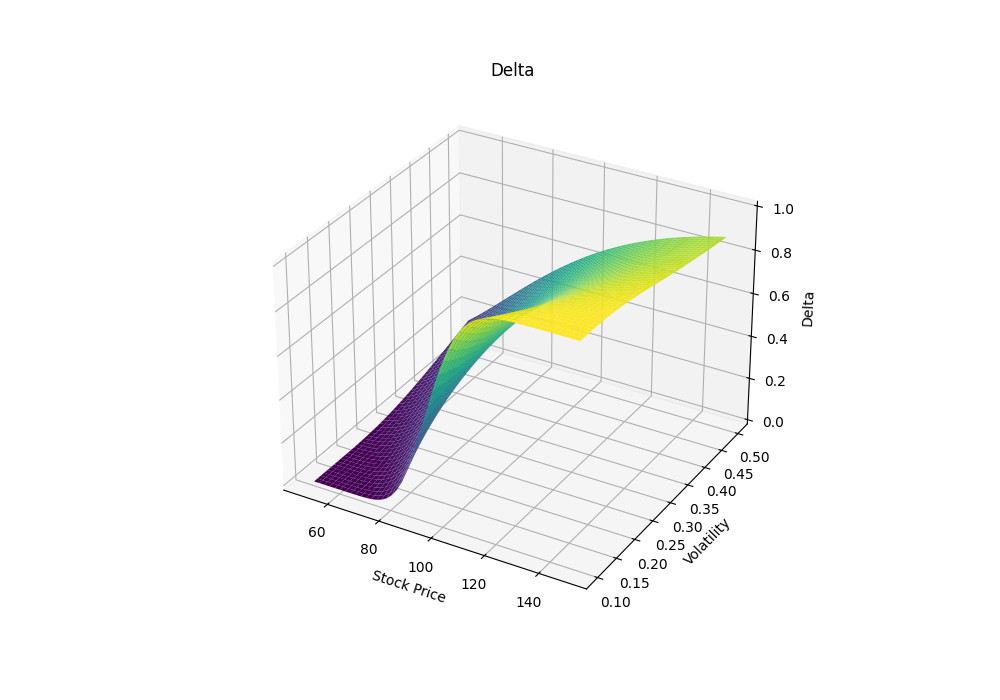
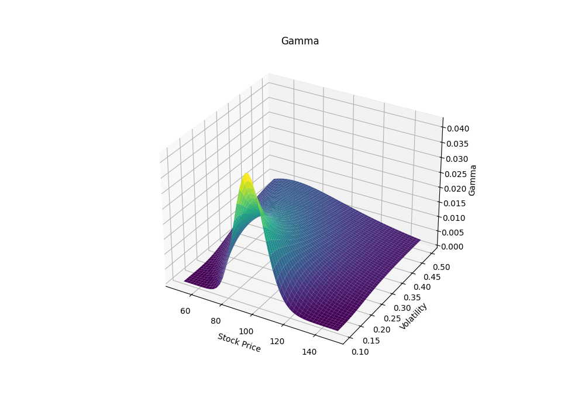
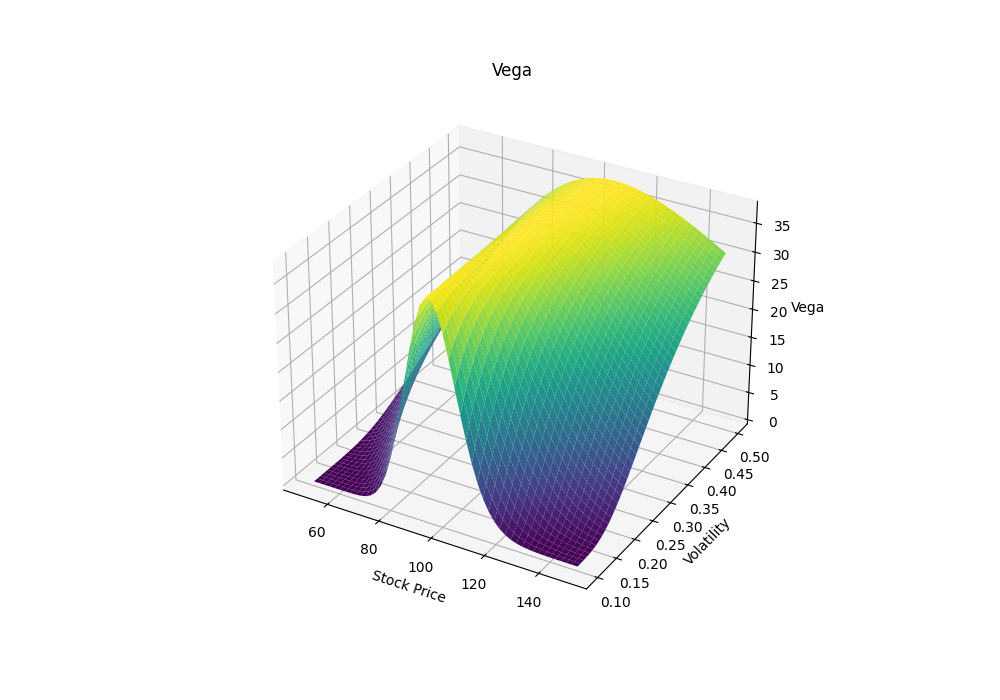
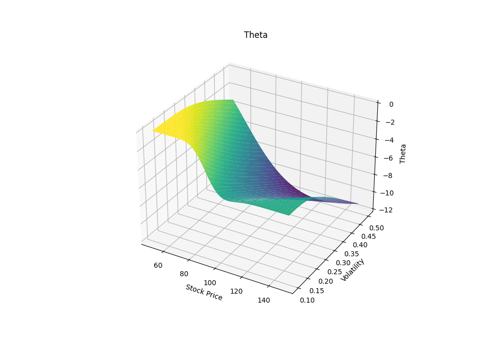

# Black–Scholes Quantitative Research (Python)

## Overview

This repository implements the Black–Scholes option pricing framework and visualizes option sensitivities using 3D surfaces.

The project demonstrates core techniques used in derivatives pricing, volatility modeling, and financial risk management.

It includes visualization of option price behavior and the Greeks across different market conditions.

---

# Quantitative Finance Context

The Black–Scholes model is a fundamental framework used in quantitative finance to price European options and analyze derivatives risk.

Understanding the behavior of option prices and Greeks is essential for:

• derivatives trading
• volatility modeling
• portfolio hedging
• financial risk management

---

# Model Inputs

Underlying price range: 50 – 150
Strike price: 100
Volatility range: 10% – 50%
Risk-free rate: 5%
Time to maturity: 1 year

---

# Key Results

The project produces 3D surfaces that illustrate how option values and sensitivities change across different market conditions.

Visualizations include:

• Option Price Surface
• Delta Surface
• Gamma Surface
• Vega Surface
• Theta Surface

---

# Results

## Results

Below are the 3D surfaces visualizing how option prices and the Greeks vary with different spot prices and volatilities.

### Option Price Surface
This chart visualizes the theoretical option price generated by the Black-Scholes model across various underlying asset prices and volatility levels. Higher spot prices generally lead to higher call option prices.

---

### Delta Surface
Delta measures the sensitivity of the option's price to a change in the price of the underlying asset. A Call Option's Delta ranges from 0 to 1, being closer to 1 when deep in-the-money.

---

### Gamma Surface
Gamma represents the rate of change of Delta with respect to changes in the underlying asset's price. It peaks when the option is near-the-money, indicating maximum sensitivity of Delta.

---

### Vega Surface
Vega measures an option's sensitivity to changes in the volatility of the underlying asset. Option prices generally increase when volatility rises, as the likelihood of finishing in-the-money increases.

---

### Theta Surface
Theta represents the time decay of an option, showing how much value the option loses per day as it approaches expiration. Long option positions generally have negative Theta.

---

# Repository Structure

black-scholes-quant-research

README.md
requirements.txt
black_scholes_quant_research.py

results/
option_price_surface.png
delta_surface.png
gamma_surface.png
vega_surface.png
theta_surface.png

---

# How to Run

Install dependencies

pip install -r requirements.txt

Run the simulation

python black_scholes_quant_research.py

All charts will be generated automatically inside the results folder.

---

# Key Takeaways

This project demonstrates:

• derivatives pricing using the Black–Scholes framework
• sensitivity analysis through option Greeks
• 3D visualization of financial models
• quantitative modeling using Python

These techniques are widely used in quantitative research and derivatives trading.

---

# Technologies

Python
NumPy
SciPy
Matplotlib
